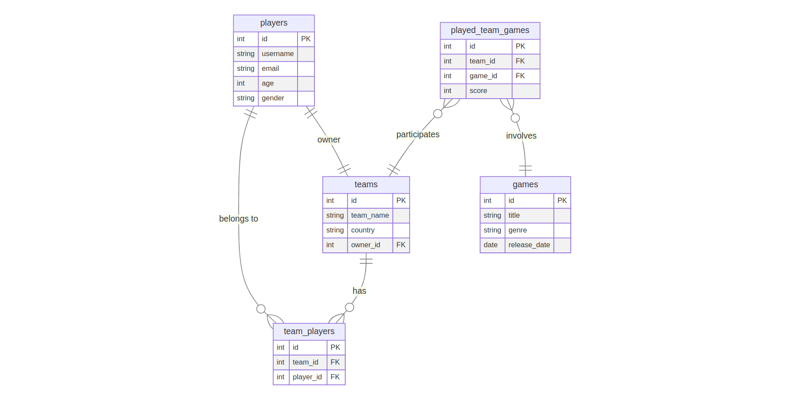

# Design Document

By Arpine Harutyunyan

Video overview: https://www.youtube.com/watch?v=DOK-EKw49b4

## Scope

The purpose of our database is to facilitate the management and organization of gaming-related data for a gaming platform. It serves as a central repository for storing information about players, games, teams, and the results of games played by teams.

* Players: This includes basic identifying information about players, such as usernames, emails, ages, and genders.
* Games: Basic information about the games available on the platform, including titles, genres, and release dates.
* Teams: Information about gaming teams, including team names, countries, and owner.
* Team Players: The relationship between players and teams, indicating which players belong to which teams.
* Played Team Games: Records of games played by teams, including details such as scores, the teams involved, and the game played.

Details about players' gaming hardware setups (e.g., computer specifications, console types) are not included in our database scope. This information is typically managed by individual players and not relevant to our gaming platform's management needs. Information about physical locations, such as player addresses or geographic regions, is not part of our database scope unless directly related to team management (e.g., team country).

## Functional Requirements

* CRUD operations for players, games and teams
* CRUD details of games played by teams, including scores, the teams involved, and the game played.
* Players should be able to manage their association with teams, such as joining or leaving teams, and team captains should be able to manage team membership.
* Players and teams should be able to view the results of games they have played, including scores and opponents.

The database will not handle the management of game content such as levels, characters, or assets.

## Representation

Entities are captured in SQLite tables with the following schema.

### Entities

The database includes the following entities:

#### Players

The `players` table includes:

* `id`: Unique ID for the player, represented as an `INTEGER`. This column serves as the `PRIMARY KEY`.
* `username`: The username chosen by the player, stored as `TEXT` and `UNIQUE`.
* `email`: Email address of the player, stored as `TEXT`.
* `age`: Age of the player, stored as `INTEGER`.
* `gender`: Gender of the player, stored as `TEXT`.

All columns in the `players` table are required (`NOT NULL` constraint) to ensure completeness of player information. The `id` column is chosen as the `PRIMARY KEY` to uniquely identify each player. The data types chosen for other attributes (`TEXT` for `username`, `email`, and `gender`, and `INTEGER` for `age`) are selected based on the nature of the data they represent. For example, `TEXT` is suitable for storing alphanumeric values such as `usernames` and `emails`, while `INTEGER` is appropriate for storing numerical data like `age`. `username` is `UNIQUE`.

#### Games

The `games` table includes:

* `id`: Unique ID for the game, represented as an `INTEGER`. This column serves as the `PRIMARY KEY`.
* `title`: The title of the game, stored as `TEXT` and `UNIQUE`.
* `genre`: Genre of the game, stored as `TEXT`.
* `release_date`: The release date of the game, stored as `DATE`.

All columns in the `games` table are required, and hence should have the `NOT NULL` constraint applied. The `id` column is chosen as the `PRIMARY KEY` to uniquely identify each game. The `TEXT` data type is chosen for `title` and `genre` attributes to store textual information. The `release_date` attribute stored as `DATE`. If precise date storage and manipulation are required, `DATE` would be more suitable. For `release_date` given default value `CURRENT_TIMESTAMP`.

#### Teams

The `teams` table includes:

* `id`: Unique ID for the team, represented as an `INTEGER`. This column serves as the `PRIMARY KEY`.
* `team_name`: The name of the team, stored as `TEXT` and `UNIQUE`.
* `country`: The country of the team, stored as `TEXT`.
* `owner_id`: ID of the owner, stored as `INTEGER`.

All columns in the `teams` table are required, and hence should have the `NOT NULL` constraint applied. The `id` column is chosen as the `PRIMARY KEY` to uniquely identify each team. `TEXT` data type is chosen for `team_name` and `country` attributes to store textual information. `owner_id` is stored as `INTEGER` and serves as a `FOREIGN KEY` referencing the `id` in the `players` table, ensuring referential integrity.

#### Team Players

The `team_players` table includes:

* `id`: Unique ID for the team-player association, represented as an `INTEGER`. This column serves as the `PRIMARY KEY`.
* `team_id`: ID of the team, stored as `INTEGER`.
* `player_id`: ID of the player, stored as `INTEGER`.

The `id` column is chosen as the `PRIMARY KEY` to uniquely identify each team-player association. `team_id` and `player_id` are stored as `INTEGER` and serve as `FOREIGN KEY` referencing the `id` columns in the `teams` and `players` tables, respectively.

#### Played Team Games

The `played_team_games` table includes:

* `id`: Unique ID for the played game, represented as an `INTEGER`. This column serves as the `PRIMARY KEY`.
* `team_id`: ID of the team, stored as `INTEGER`.
* `game_id`: ID of the game, stored as `INTEGER`.
* `score`: The score achieved by the team in the game, stored as `INTEGER`.

The `id` column is chosen as the `PRINAMRY KEY` to uniquely identify each played game. `team_id` and `game_id` are stored as `INTEGER` and serve as `FOREIGN KEY` referencing the `id` in the `teams` table and the `id` in the `games` table, respectively. `score` is stored as `INTEGER` to represent numerical scores achieved by the team.

### Relationships

The below entity relationship diagram describes the relationships among the entities in the database.

As described by the diagram:

* One-to-One Relationship Between Players and Teams:
Each player can own exactly one team, and each team is owned by exactly one player. This relationship is represented by the owner_id foreign key in the teams table, which references the id primary key in the players table.
* Many-to-Many Relationship Between Players and Teams:
Each player can belong to 0 or many teams, and each team can have 0 or many players. This relationship is represented by the team_players table, where multiple players can be associated with multiple teams.
* Many-to-Many Relationship Between Teams and Games:
Multiple teams can participate in 0 or many games, and each game can involve 0 or many teams. This relationship is captured by the played_team_games table, where multiple teams can play multiple games.

## Optimizations

Indexing the team_name column facilitates faster retrieval of teams based on their names. This is particularly useful when searching for specific teams by name or when filtering teams in queries involving team-related operations.

Indexing the title column enables rapid retrieval of games based on their titles. This is particularly beneficial for queries where users search for specific games by their titles or when filtering games based on their names.

We create a view named team_scores_view that aggregates scores for each team across all games played. This view simplifies querying for total scores of teams, eliminating the need to manually calculate scores by summing individual game scores. By pre-computing and storing aggregated scores, the view improves query performance and reduces the complexity of score-related queries.

## Limitations

Static Game Information: The database schema stores basic information about games such as titles, genres, and release dates. However, it does not account for dynamic or frequently changing game data such as updates, patches, or downloadable content (DLC). Incorporating real-time or versioned game data would require additional tables and mechanisms to track and manage game updates effectively.

Limited Gameplay Details: The schema captures high-level information about games played by teams, including scores and participating teams. However, it does not delve into detailed gameplay mechanics, player statistics, or match events. Representing intricate gameplay details would necessitate a more comprehensive data model with additional tables and attributes to capture gameplay events, player actions, and in-game interactions.
